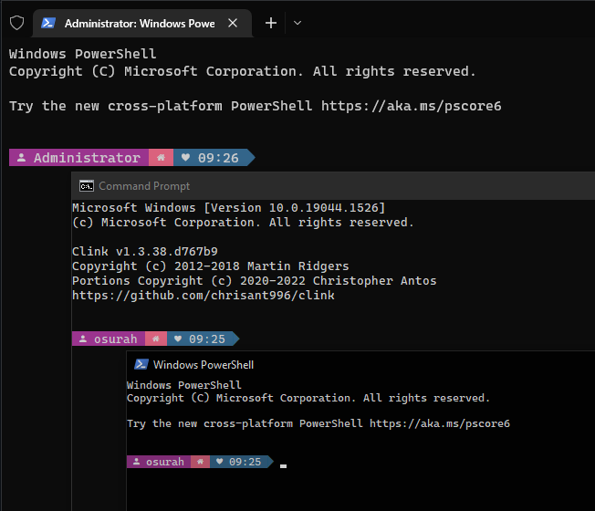

# starship-powerline-preset
A simple powerline configuration for starship
Inspired by [pastel powerline](https://starship.rs/presets/pastel-powerline.html)

## Prerequisites
- [Caskaydia Cove Nerd Font](https://github.com/ryanoasis/nerd-fonts/releases/download/v2.1.0/CascadiaCode.zip) is required for this preset
- Starship should be installed
- Other prerequisites may vary on CLI being modded  (All instructions and details available on [starship official website](https://starship.rs/presets/pastel-powerline.html))

## Installation
Download the .toml file from releases
Installation instructions can be found on [starship.rs](https://starship.rs/)

## Todo
- [ ] Check the compatibility with other CLIs
- [ ] Add support for all the language modules

